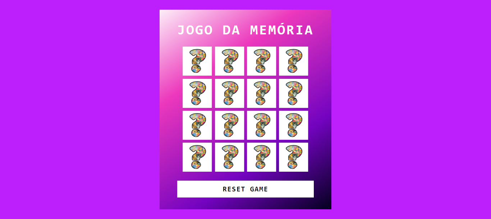
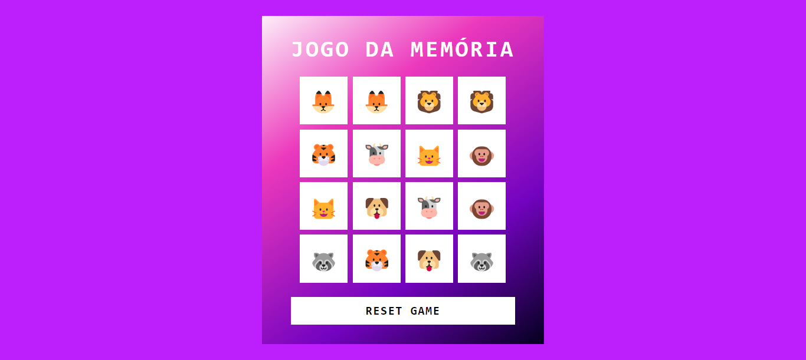
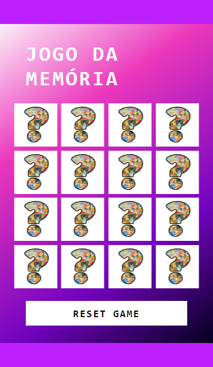
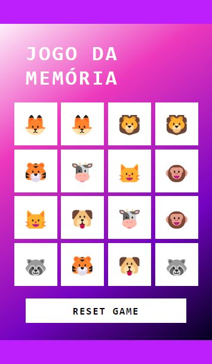

# JOGO DA MEMÓRIA

# Sobre o projeto
Trata de um jogo que tem como objetivo localizar os pares de cartas que contenham animais idênticos.
O foco deste projeto foi praticar a criação de elementos de forma dinâmica.

## Tecnologias utilizadas

* HTML5 e CSS3 para a estrutura e aparência do jogo.
* JavaScript para a lógica de programação e interatividade.

## Funcionalidades
* **Virada de cartas e combinações**: Permite que o usuário vire uma carta e, caso haja combinações, as mesmas permanecem viradas, senão, retornam a posição inicial (animal oculto);
* **Reiniciar game**: Ao finalizar o jogo é possível jogar novamente.

## Como jogar

1. Clone este repositório para sua máquina local.
1. Abra o arquivo index.html em seu navegador web.
1. Use o botão esquerdo do mouse para virar as cartas.

## Resultado obtido

### Versão Desktop

### Versão Mobile

